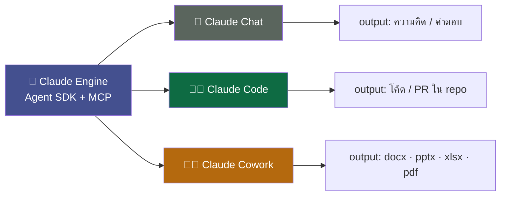
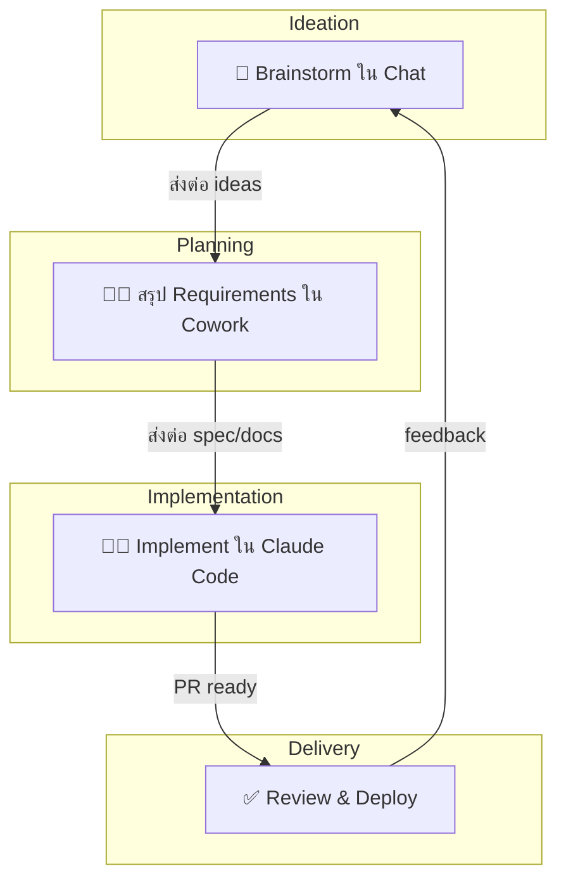
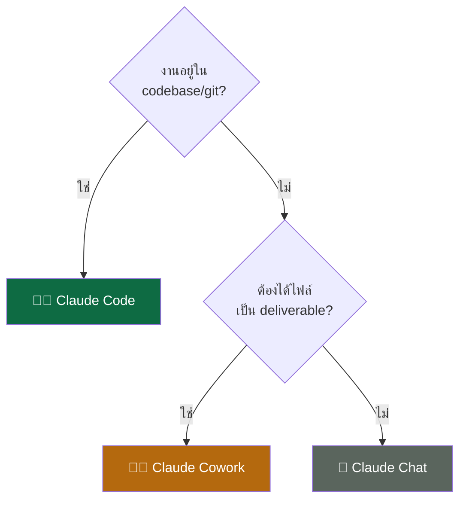
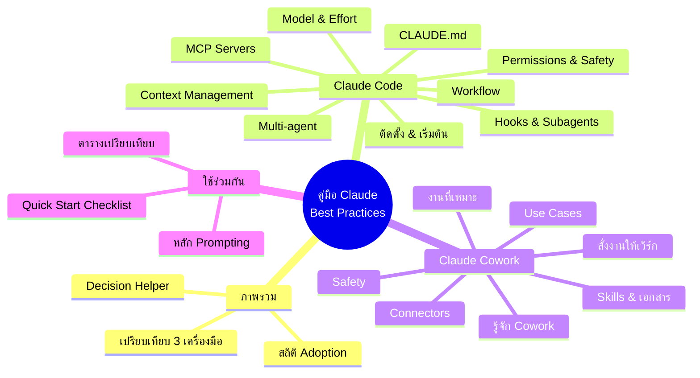

# 📘 คู่มือ Best Practices — Claude Code & Claude Cowork (2026)

เอกสารประกอบการเทรนนิ่งสำหรับ **developer** ที่ใช้ Claude Code และ **knowledge worker** ที่ใช้ Claude Cowork

## 🎯 จุดประสงค์

- เป็นแหล่งรวมแนวทางปฏิบัติที่ดี (Best Practices) ในการใช้งาน Claude
- ใช้เป็นสื่อประกอบการสอนและทบทวนภายในทีม
- ครอบคลุมทั้ง Claude Code (สำหรับ dev) และ Claude Cowork (สำหรับงาน knowledge work)

## 🗺️ ภาพรวมเครื่องมือ



## 🔄 Workflow แนะนำ



## 📊 Decision Flow — เลือกเครื่องมือไหนดี?



## 📂 โครงสร้างโปรเจกต์

```
Everything about Claude/
├── README.md                                ← ไฟล์นี้
├── index.html                               # Presentation หลัก (GitHub Pages)
└── docs/
    └── changelog.md                         # บันทึกการเปลี่ยนแปลง
```

## 🚀 วิธีใช้งาน

1. เปิดไฟล์ `index.html` ในเบราว์เซอร์ หรือเข้าผ่าน GitHub Pages
2. ใช้ปุ่มกรองด้านบนเพื่อเลือกดูเนื้อหาเฉพาะกลุ่ม:
   - 🧑‍💻 **Claude Code** — สำหรับ developer
   - 🧑‍💼 **Claude Cowork** — สำหรับ knowledge worker
   - 🤝 **ใช้ร่วมกัน** — หลักการที่ใช้ได้ทั้งสองฝั่ง

## 📋 เนื้อหาหลัก



## 🛠️ เทคโนโลยีที่ใช้

- HTML/CSS/JS (Single-file, ไม่มี dependency ภายนอก)
- Google Fonts: Bai Jamjuree, IBM Plex Sans Thai, IBM Plex Mono
- Responsive design รองรับทั้ง desktop และ mobile

## 📅 อัปเดตล่าสุด

มิถุนายน 2026 — ดูรายละเอียดเพิ่มเติมที่ [changelog](./docs/changelog.md)

## 👤 ผู้จัดทำ

**Suphakorn Palathai (Korn)** — สำหรับใช้ประกอบการเทรนนิ่ง 2026
